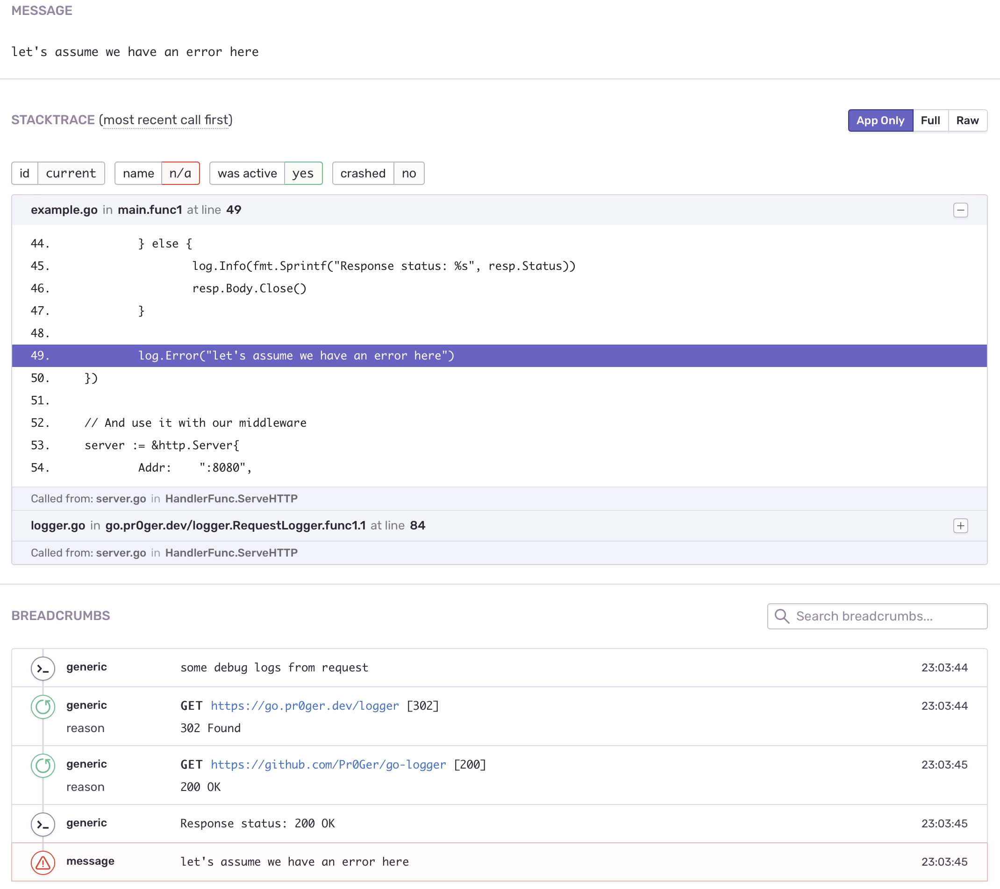

# go-logger [![GoDoc][doc-img]][doc] [![Build Status][ci-img]][ci]

Library for intergrating [zap](https://pkg.go.dev/go.uber.org/zap) logger with [Sentry](https://sentry.io/). 

## Installation

`go get -u go.pr0ger.dev/logger`

## Show me the code

```go
// Create core for logging to stdout/stderr
localCore := logger.NewCore(true)

// Create core splitter to logging both to local and sentry
// zapcore.NewTee also can be used, but is not recommended if you want to use RequestLogger middleware
core := logger.NewSentryCoreWrapper(localCore, sentry.CurrentHub())

// And create logger
log := zap.New(core)

log.Debug("this event will be logged to stdout but will not appear in request breadcrumbs")

// Create handler for network requests
handler := http.HandlerFunc(func(w http.ResponseWriter, r *http.Request) {
    log := logger.Ctx(r.Context())

    log.Debug("some debug logs from request")

    // Create an HTTP client with our transport 
    client := http.Client{
        Transport: logger.NewBreadcrumbTransport(sentry.LevelInfo, http.DefaultTransport),
    }
    
    // We need to pass current context to HTTP request so transport will know where to log
    req, _ := http.NewRequestWithContext(r.Context(), http.MethodGet, "https://go.pr0ger.dev/logger", nil)

    resp, err := client.Do(req)
    if err != nil {
        log.Warn("request failed", zap.Error(err))
    } else {
        log.Info(fmt.Sprintf("Response status: %s", resp.Status))
        resp.Body.Close()
    }

    log.Error("let's assume we have an error here")
})

// And use it with our middleware
server := &http.Server{
    Addr:    ":8080",
    Handler: logger.RequestLogger(log)(handler),
}

_ = server.ListenAndServe()
```




[doc-img]: https://godoc.org/go.pr0ger.dev/logger?status.svg
[doc]: https://pkg.go.dev/go.pr0ger.dev/logger
[ci-img]: https://drone.pr0ger.dev/api/badges/Pr0Ger/go-logger/status.svg
[ci]: https://drone.pr0ger.dev/Pr0Ger/go-logger

